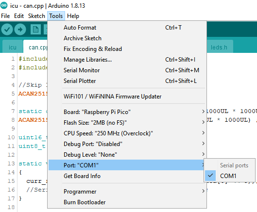

# SR-14 Instrument Cluster Repository
A.k.a the ICU. 
 

## Dependencies
- Arduino IDE
- earlephilhower Raspberry Pi Pico library
- ACAN2515 2.1.0 library
- U8g2 2.30.1 library (**AND NOT ANY VERSION AFTER**)
- MD_MAX72XX 3.3.0 library
 

## Environment Setup
1. Install [git](https://git-scm.com/downloads)
2. Clone this repo into any reachable folder using, in a command line of your choice (WSL Ubuntu, PowerShell, Terminal, etc), `git clone https://github.com/spartanracingelectric/SRE6-InstrumentCluster.git`
    1. Change your branch if necessary by using `git checkout <BRANCH_NAME>`
3. Install the [Arduino IDE](https://www.arduino.cc/en/software)
4. Install [earlephilower's Raspberry Pi Pico library](https://github.com/earlephilhower/arduino-pico#installing-via-arduino-boards-manager)
5. Within the Arduino IDE `Tools->Manage Libraries...`, install the ACAN2515, U8g2, and MD_MAX72XX libraries. **MAKE SURE U8g2 IS VERSION 2.30.1**
6. Hook up a microUSB cable to the ICU board.
7. Open `icu.ino` via the Arduino IDE within the SRE6-InstrumentCluster/icu/ folder
8. Configure Arduino IDE board to the Raspberry Pi Pico.
    1. 
    2. The Pico is able to be overclocked to at least ~250MHz (based on silicon lottery). Feel free to experiment for each specific Pico. If the board seems like it bricks after an overclock, you may need to access the Pico BOOTSEL button. To unbrick, unplug the USB cable from your computer, hold the BOOTSEL button on the Pico, and reinsert the USB cable while holding the button. You should be able to upload with a slower clock speed which should unbrick your Pico.
9. Upload the sketch!
    1. If you get a `No drive to deploy` error, double check the `Port:` field in the `Tools` tab is set to a USB/COM port that the Pico is connected to. If this still doesn't work, do the BOOTSEL procedure as previously stated.
 

## SR-14 Instrument Cluster Team
_Shinika Balasundar_, Software Lead, Firmware & Hardware (Core Software Design, HW & FW Validation and Integration) 
_Sean Widjaja_, Project Lead, Hardware (Schematic and PCB design, PCBA) 
_Johnathon Lu_, Project Lead, Firmware (LCD FW design) 
_Shubham Mishra_, Project Designer, Firmware (LCD FW design) 
 

## Links
[Spartan Racing Website](https://www.sjsuformulasae.com/) 
[Pico Pinout](https://microcontrollerslab.com/wp-content/uploads/2021/01/Raspberry-Pi-Pico-pinout-diagram.svg) 
[Hardware Bill of Materials](https://docs.google.com/spreadsheets/d/1UGtSwsXKJZJlghaglvCwl1YWrQGyW8ZNmpcijJZi6sg/edit#gid=0) 
[CDR Slides](https://docs.google.com/presentation/d/1rN90VLVj-aSsbMOXEkgrvWsR6Ec_Ea_NRq933g5CcTc/edit#slide=id.g164c7d6d0b3_1_0) 
[DDR Slides](https://docs.google.com/presentation/d/1xZXBK4U6u2NcAG4G7vK2h8TG5N_wlqzYkh3I5ew-82A/edit#slide=id.g171971f4135_0_310) 
